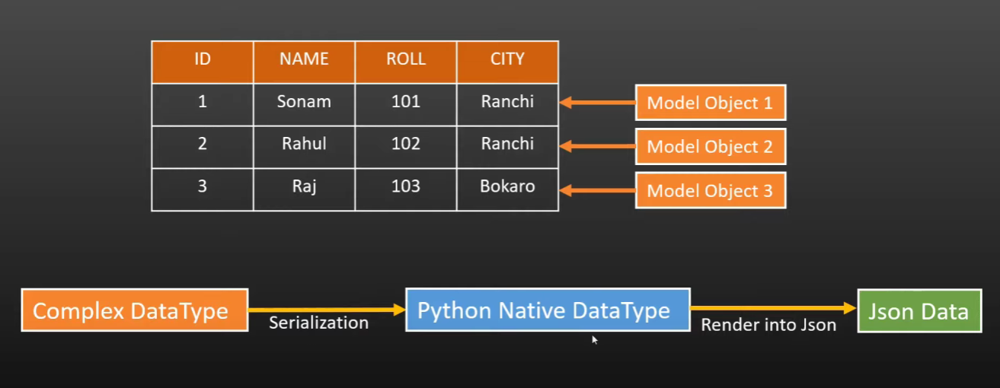
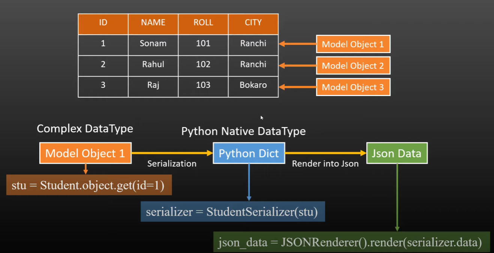
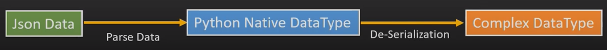

# Django Rest Framework

## API 
An API (Application Programming Interface) is a set of rules and protocols that allows different software applications to communicate with each other. APIs define the methods and data formats programs can use to request and exchange information, making it easier to integrate functionality from external services or libraries into applications. They act as a bridge between different systems, enabling a variety of functions, like retrieving data, sending commands, or connecting with remote services.

Here’s a breakdown of how APIs work and why they’re useful:
* Endpoints: APIs are accessed through specific URLs called endpoints, each representing a different function of the API.
* Request Methods: The main HTTP request methods are:
  * GET (to retrieve data)
  * POST (to send data to create something new)
  * PUT/PATCH (to update existing data)
  * DELETE (to remove data)
* Response Format: APIs often use JSON or XML to structure the data they return, which is easy for machines to parse.
* Authentication: Many APIs require authentication (like API keys) to ensure secure access.

## WEB API
A Web API is a specific type of API that uses web-based protocols (like HTTP) to allow applications to communicate with each other over the internet. Web APIs enable applications to access the data or functionality of another application or service via a network, typically through URLs (web addresses).

Here's how Web APIs work and why they're important:
* Client-Server Interaction: A client (like a web browser or mobile app) sends HTTP requests to a Web API on a server. The server processes the request and sends back a response, often in JSON or XML format.
* RESTful Web APIs: Many Web APIs follow REST (Representational State Transfer) principles, meaning they are designed to work with standard HTTP methods:
  * GET: Retrieve information
  * POST: Send data to create something new
  * PUT/PATCH: Update existing data
  * DELETE: Remove data
* Accessing Third-Party Services: Web APIs make it easy for applications to use the functionality of third-party services (like social media, payment gateways, weather data, or geolocation) without embedding that functionality directly.
*Authentication and Security: Web APIs often use authentication methods like API keys, OAuth tokens, or JWT (JSON Web Tokens) to verify user access and secure data.

Examples of Web APIs: Examples include the Google Maps API, Twitter API, OpenWeather API, and PayPal API, which allow developers to integrate location data, social media content, weather updates, or payment processing into their applications.

## REST and REST API
### REST
REST (Representational State Transfer) is an architectural style for designing networked applications. REST is not a protocol or a standard but rather a set of guidelines or constraints that, when followed, enable reliable, scalable, and stateless communication between client and server. RESTful systems typically use HTTP to communicate between a client (like a web browser or mobile app) and a server.

Key Principles of REST
* Statelessness: Each request from a client to a server must contain all the information needed to understand and process the request. The server doesn’t store any client state between requests.
* Client-Server Separation: The client and server are separated, allowing each to evolve independently. The client handles the user interface, while the server handles data processing and storage.
* Uniform Interface: REST APIs follow a consistent, standard interface, making it easier for developers to use and maintain.
* Resource-Based: In REST, all content is treated as resources (like users, photos, or posts). Each resource is accessible via a unique URL (endpoint), representing an entity on the server.
* HTTP Methods: REST typically relies on standard HTTP methods for CRUD (Create, Read, Update, Delete) operations:
  * GET: Retrieve data (e.g., GET /users retrieves a list of users)
  * POST: Create new data (e.g., POST /users creates a new user)
  * PUT/PATCH: Update data (e.g., PUT /users/1 updates the user with ID 1)
  * DELETE: Remove data (e.g., DELETE /users/1 deletes the user with ID 1)
* Stateless Caching: Responses should include caching information to avoid unnecessary server requests and improve performance.

### REST API
A REST API (also known as RESTful API) is an API that adheres to REST principles, allowing applications to interact with web services using standard HTTP methods. REST APIs are commonly used to allow different software applications to interact with web servers in a simple, scalable way.

Why Use a REST API?
* Scalability: RESTful APIs are scalable and can handle a high volume of requests because they are stateless.
* Flexibility: The separation of client and server allows each to evolve independently, making it easier to update or change one without affecting the other.
* Ease of Integration: REST APIs are commonly used and compatible with many web services, making it easier for different systems to connect and interact.

Example of a REST API in Action
Suppose you have a REST API for a library. Here's how some endpoints might look:
* GET /books – Retrieves a list of all books.
* GET /books/1 – Retrieves details about the book with ID 1.
* POST /books – Adds a new book.
* PUT /books/1 – Updates the book with ID 1.
* DELETE /books/1 – Deletes the book with ID 1.
Each endpoint represents a resource (in this case, books), and each HTTP method performs a specific action on that resource.

## DRF 
DRF (Django REST Framework) is a powerful and flexible toolkit for building Web APIs in Django, a popular Python web framework. DRF makes it easier to create RESTful APIs by providing tools and abstractions that streamline tasks such as serialization, authentication, and view handling, making it a popular choice for developing web APIs in Python.

Key Features of Django REST Framework (DRF)
1. Serialization:
  * DRF’s serializers convert complex data types, such as Django models, into JSON or other content types suitable for APIs.
  * Serializers also handle data validation and deserialization, converting JSON input data back into Django objects.

2. View Classes:
  * DRF provides generic view classes (e.g., ListAPIView, CreateAPIView) that handle common API operations, such as listing, creating, updating, and deleting objects.
  * It also supports viewsets, which combine multiple views for a single resource into one set, reducing code repetition.

3. Authentication and Permissions:
  * DRF offers built-in support for various authentication mechanisms, such as Token-based authentication, OAuth, and session-based authentication.
  * Permissions control access to the API, enabling you to define rules for who can view, create, update, or delete resources.

4. Browsable API Interface:
  * One of DRF’s unique features is the browsable API interface, allowing developers to explore and interact with the API directly in the browser. This makes testing and debugging easier.

5. Throttling and Rate Limiting:
  * DRF provides throttling options to limit the rate of requests, which helps prevent abuse and protects your API from being overwhelmed.

6. Pagination:
  * DRF offers several pagination styles (such as limit-offset, cursor-based, and page-number pagination) to handle large datasets effectively.

7. Customizable:
  * DRF is highly customizable, allowing developers to create custom serializers, views, permissions, and more to meet specific needs.

Basic DRF Workflow
* Define Models: Create Django models to represent your data.
* Create Serializers: Write serializers to transform model data into JSON and validate input data.
* Create Views: Use DRF’s generic views or viewsets to create API endpoints for different resources.
* Define URLs: Map URLs to your views so that they can be accessed by clients.
* Set Permissions and Authentication: Configure who can access the API and how they authenticate.

Why Use DRF? 
DRF simplifies the process of creating robust APIs with Django by providing built-in features and a consistent structure for serialization, views, authentication, and more. This makes DRF a powerful tool for building production-ready APIs quickly and efficiently in Python

## Serialization
Implementation in Project1.
### Python Json (Not used commonly)
In Python, JSON (JavaScript Object Notation) is a popular data format used to store and exchange data between a server and a client. Python has a built-in library, called json, to work with JSON data, allowing you to easily convert Python data structures to JSON and vice versa.

Converting Python Objects to JSON (Serialization)
To convert Python objects like dictionaries, lists, tuples, or strings into JSON format, you can use json.dumps() or json.dump().
* json.dumps(): Converts Python data to a JSON-formatted string.
* json.dump(): Writes JSON data directly to a file.

Converting JSON to Python Objects (Deserialization)
To parse JSON and convert it into Python objects, use json.loads() or json.load().
* json.loads(): Parses JSON data from a string and converts it to a Python object.
* json.load(): Reads JSON data from a file and converts it to a Python object.

### Serializer
In DRF, serializer are responsible for converting complex data such as querysets and model instance to native python datatype (called serialization) that can then be easily rendered into JSON or other content type which is understandable by frontend.

Steps to create a serializer: (for code reference open Project1, API app)
1. Define your Model
  First, create the model that you want to serialize if it doesn’t already exist. Models define the structure of your data.
2. Create the Serializer
  In Django REST Framework, serializers are created in a file usually named serializers.py.
  * Create the serializers.py file if it doesn’t exist.
  * Import DRF’s serializers module and the model you want to serialize.
3. Define the Serializer class
  Create a serializer class that maps the model fields to JSON format.
  * If you’re using a model and only need basic CRUD operations, you can use ModelSerializer, which automatically maps model fields to serializer fields.
  * For more control or if you’re not using a model, you can use Serializer and define fields manually.
4. Using the Serializer in Views
  You can now use the serializer in views to handle incoming data and format outgoing responses. You might want to display a list of student or a single student details.
5. configure Urls
  Set up URL routes for the views so that they’re accessible in your API.
6. Test your Serializer
  Run your server and test your serializer by accessing the endpoints. You can use tools like Postman, curl, or Django’s browsable API interface to see the JSON data generated by the serializer.

JsonResponse method-  
JsonResponse(data, encoder=DjangoJSONEncoder, safe = True, json_dumps_params = None, **kwargs) 
It is an HttpResponse subclass that helps to create a Json-encoded response. It inherits most behavior from its superclass with a couple of differences:-  
* Its default Content-Type header is set to application/json.
* The first parameter, data, should be a dict instance. If the safe parameter is set to False, it can be any JSON-serializable object.
* The encoder, which defaults to django.core.serializers.json.DjangoJSONEncoder, will be used to serialize the data.
* The safe boolean parameter defaults to True. If it’s set to False, any object can be passed for serialization (otherwise only dict instances are allowed). If safe is True and a non-dict object is passed as the first argument, a TypeError will be raised.
* The json_dumps_params parameter is a dictionary of keyword arguments to pass to the json.dumps() call used to generate the response.

How is data Serialized

## De-serialization
Implementation in Project2.
### De-serialization
Deserialization is the reverse of serialization. It involves taking serialized data (like a JSON string) and reconstructing it back into a Python object, C# object, or any native language object.

Why is Deserialization Needed?
* Data Reconstruction: Rebuild objects from data received over a network.
* Read Files: Load configuration files, logs, or cache files back into a usable format.
* API Consumption: Convert JSON responses from APIs back into native objects for further processing.

### BytesIO
BytesIO is a memory buffer that acts like a file for binary data. It is part of Python's io module and is commonly used to work with binary data without actually creating a physical file on disk. It allows you to read from and write to binary streams as if they were files.

Why Use BytesIO?
* Avoid creating temporary files on disk when working with binary data (like images, PDFs, etc.).
* Perform read/write operations in memory (faster than disk operations).
* Useful for streaming binary data over networks.

### JSONParser
JSONParser is a tool or utility for parsing (converting) JSON data into a usable, structured format (like a dictionary, list, or object in a programming language). It takes a JSON string and parses it into a format that can be manipulated programmatically.

Why Use JSONParser?
* To read and process JSON responses from APIs.
* To convert JSON configuration files into dictionaries or objects.
* To extract specific data points from large JSON payloads.

### JSONRenderer
JSONRenderer is a tool for converting Python objects into JSON format. It is the reverse of JSONParser. It takes objects (like dictionaries or lists) and converts them to JSON format, often as part of a web API response.

Why Use JSONRenderer?
* To send JSON responses to API clients.
* To convert Python objects to JSON for logging, debugging, or saving.
* To serialize data in a format that can be transmitted over the network (like in REST APIs).

### When to Use Each One?
* Use BytesIO when you need to handle binary data in memory (like images, PDFs, or files) without creating a file on disk.
* Use JSONParser when you receive JSON data from an API, file, or request body, and you want to convert it into a Python object (like a dictionary or list).
* Use JSONRenderer when you want to convert Python objects into JSON to send it as a response in a web API or for serialization before saving to a file.

Let’s combine BytesIO, JSONParser, and JSONRenderer into one example.

Scenario:
* You receive a binary request body (like from an API) that contains JSON data.
* You parse the binary data using BytesIO and convert it into a Python object using JSONParser.
* You make changes to the Python object and render it back as JSON using JSONRenderer.

Steps to create a de-serializer:
1. Create a Django Model - Before you can deserialize data, you need a model to define the structure of the data you want to store. 
2.  Create a Serializer- A serializer in Django REST Framework (DRF) defines how incoming raw data (like JSON) is converted into a Python object and validated.
3. Write a View to Deserialize Data - A view is where we handle the incoming data, parse it, validate it, and save it to the database. We'll use Django REST Framework parsers like JSONParser to convert incoming JSON to Python objects. 
  Deserialization Steps:
  * Read request body: request.body reads the binary data from the request.
  * Create a stream: The binary data is converted to an in-memory stream using io.BytesIO().
  * Parse the stream: JSONParser().parse(stream) parses the binary JSON data to a Python dictionary.
  * Send data to serializer: StudentSerializer(data=python_data) sends the data to the serializer.
  * Validate the data: serializer.is_valid() checks if the incoming data matches the serializer constraints.
  * Save Data: If the data is valid, serializer.save() calls the create() method in the StudentSerializer to save the Student object in the database.
  * Error Handling: If the data is invalid, it returns the validation errors.

## CURD and Views
Implementation in Project3.
### CURD operation
CRUD stands for Create, Read, Update, and Delete, which are the four basic operations you can perform on a database or resource in an application. In web development, CRUD operations are typically linked with HTTP methods as follows:
| **Operation** | **HTTP Method** | **Endpoint**       | **Action**                                |
|---------------|-----------------|-------------------|-------------------------------------------|
| **Create**    | **POST**         | `/books/`         | Add a new book to the database. The request body contains the book details like title, author, etc. |
| **Read (All)**| **GET**          | `/books/`         | Retrieve a list of all books from the database. |
| **Read (One)**| **GET**          | `/books/<id>/`    | Retrieve details of a specific book using its unique **id**. |
| **Update**    | **PUT / PATCH**  | `/books/<id>/`    | Update an existing book's information using its **id**. The request body contains the fields to be updated. |
| **Delete**    | **DELETE**       | `/books/<id>/`    | Delete a specific book from the database using its **id**. |

### FVB and CBV
A Function-Based View (FBV) is a simple, straightforward way to write views in Django. Each view is a Python function that takes an HTTP request and returns an HTTP response.
Key Characteristics of FBVs
* Simpler and more readable for small, straightforward logic.
* Each view corresponds to an individual function.
* @api_view() decorator is used in Django REST Framework (DRF) to specify which HTTP methods are allowed.
* Less reusability, as you have to repeat similar logic for other views.
How an FBV Works
* Input: It takes a request (request object) and optional URL parameters.
* Process: Executes the logic for handling GET, POST, PUT, DELETE requests.
* Output: Returns an HTTP response or JSON response.

A Class-Based View (CBV) is a view written as a Python class instead of a function. It defines methods for handling different HTTP requests, like get(), post(), put(), delete().
Key Characteristics of CBVs
* Better for reusability and inheritance.
* DRY (Don’t Repeat Yourself): No need to repeat the same logic for each view.
* Uses Django’s built-in classes like ListView, DetailView, CreateView, etc.
* Can be easily extended using inheritance.
* More complex to understand for beginners but offers cleaner and more organized code.
How a CBV Works
* Input: HTTP request sent to a view class.
* Process: Calls the corresponding class method (get, post, put, etc.).
* Output: Returns an HTTP response or JSON response.

#### **Key Differences: Function-Based Views (FBV) vs Class-Based Views (CBV)**

| **Criteria**         | **Function-Based Views (FBV)**  | **Class-Based Views (CBV)**    |
|---------------------|---------------------------------|---------------------------------|
| **Code Length**       | Longer, repetitive             | Shorter, reusable methods       |
| **Readability**       | Simple, beginner-friendly      | More abstract, harder for newbies |
| **Customization**     | Simple to customize            | Customization requires inheritance |
| **Reusability**       | Hard to reuse                  | More reusable, thanks to classes |
| **Code Organization** | All logic in one function      | Logic divided into methods      |
| **Best For**          | Small projects                 | Large, scalable applications    |
| **HTTP Methods**      | Manually handle GET, POST, etc.| Handles GET, POST, etc. with methods |
| **Repetition**        | Repeats similar logic in views | DRY, reuse existing classes     |

#### **When to Use: Function-Based Views (FBV) vs Class-Based Views (CBV)**

| **When to Use FBV?**         | **When to Use CBV?**           |
|-----------------------------|---------------------------------|
| **Small apps or prototypes**  | **Large, scalable applications** |
| **Simple logic**               | **Complex logic, inheritance required** |
| **For learning purposes**      | **When you want DRY and clean code** |
| **If you want full control**   | **When you want reusability**  |

> **Note**: Use **FBV** for simple, small applications or if you’re a beginner. Use **CBV** for larger, scalable applications where reusability and DRY principles are important.

## Validation
Implementation in Project4. 
Validation is crucial for ensuring that the data coming into your API is clean, structured, and meets certain criteria.
Here's an explanation of field-level validation, object-level validation, and validators in DRF:
1. Field-Level Validation
  Field-level validation is performed on individual fields of a serializer. You define custom validation logic for a specific field by adding a method named validate_<field_name> to your serializer class. 
  Use Case:
  * When you need to validate one specific field independently of others.

2. Object-Level Validation
  Object-level validation validates the entire object, allowing you to check interdependencies between multiple fields. You implement this by overriding the validate method in the serializer class. 
  Use Case:
  * When validation depends on the relationship between multiple fields.

3. Validators
  Validators are reusable, standalone validation functions or classes that can be applied to serializer fields. They allow you to define validation logic separately and use it across multiple serializers. 
  Types of Validators:
  * Function-Based Validators: Simple functions applied to fields.
  * Class-Based Validators: Classes that implement the __call__ method for complex validation logic.

Comparison:
| Feature         | Field-Level Validation              | Object-Level Validation        | Validators                      |
|------------------|-------------------------------------|---------------------------------|---------------------------------|
| **Scope**       | Individual fields                  | Entire object                  | Specific fields                |
| **Dependency**  | Independent of other fields        | Validates interdependencies    | Reusable across serializers    |
| **Usage**       | `validate_<field_name>` method     | `validate` method              | Functions or classes applied to fields |

## ModelSerializer
implementation in Project5. 
ModelSerializer is a subclass of Serializer in Django REST Framework (DRF) designed to simplify the process of creating serializers for Django models. It provides shortcuts for creating serializers that automatically handle many common tasks, such as field creation, validation, and instance saving. 
Key Features of ModelSerializer:
* Automatic Field Creation:
  * ModelSerializer automatically creates serializer fields based on the fields of the associated Django model.
  * You can specify which fields to include, exclude, or make read-only using the Meta class.
* Default Validators:
  * It uses the model field’s constraints (like unique, max_length, etc.) and validation rules automatically.
  * Example: If a field is marked as unique in the model, the serializer enforces this constraint during validation.
* Simplified Save Method:
  * The save() method automatically creates or updates a model instance, so you don’t need to explicitly handle instance creation or updates unless customization is required.
* Custom Validation:
  * Supports field-level (validate_<field_name>) and object-level (validate) validation.
* Relationships Handling:
  * Automatically supports ForeignKey, ManyToManyField, and other relationships.
  * You can customize how related fields are serialized using options like depth or custom serializers.
* Overriding Field Behavior:
  * Allows overriding default behavior for individual fields by explicitly defining them.
* Custom Save Logic:
  * If you need custom save logic, you can override the create and update methods.
* Efficient Query Usage:
  * When used with ModelViewSet or other DRF components, ModelSerializer helps ensure efficient database querying.

### key difference between Serializer and ModelSerializer

| Feature                 | `Serializer`                          | `ModelSerializer`                       |
|-------------------------|----------------------------------------|-----------------------------------------|
| **Dependency on Model** | Not tied to any model                 | Directly tied to a Django model         |
| **Field Definition**    | Fields must be defined manually       | Fields are generated automatically      |
| **Boilerplate Code**    | Requires more code                    | Requires less code                      |
| **Validation**          | Custom validation must be written     | Uses model field constraints by default |
| **Save Method**         | Must implement instance creation      | Handles instance creation and update automatically |
| **Relationships**       | Must be handled manually              | Automatically serializes related fields |
| **Use Case**            | For non-model data or custom cases    | For APIs directly tied to models        |

When to Use:
* Use ModelSerializer:
  * When the data structure directly maps to a Django model.
  * To save time and reduce repetitive code.
* Use Serializer:
  * For data structures not tied to Django models (e.g., external APIs or complex nested data).
  * When you need full control over the serialization and validation process.

## Views
In Django REST Framework (DRF), a View is the central component for handling incoming HTTP requests, processing them, and returning appropriate HTTP responses. Views are responsible for the logic of your API, including retrieving data, updating resources, and handling various request methods (e.g., GET, POST, PUT, DELETE).
### Function Based API views
Implementation in Project6. 
A function-based API view is a simple Python function that directly handles API logic for specific HTTP methods. DRF provides the @api_view decorator to define which HTTP methods a function should handle. 
Features:
* Minimal abstraction.
* Explicitly handles HTTP methods.
* Easier for small-scale or simple applications.

Advantages:
* Easy to set up and understand.
* Ideal for small projects or endpoints with simple logic.

Disadvantages:
* Code becomes repetitive and harder to maintain as complexity increases.
* Doesn't promote code reuse.

### Class Based API views
Implementation in Project7. 
A class-based API view uses the APIView class to define API logic. Instead of a single function handling multiple HTTP methods, each method (e.g., get, post, put, etc.) is defined as a class method. 
Features:
* Object-oriented approach.
* Better code organization and reusability.
* Supports middleware, mixins, and inheritance for extensibility.

Advantages:
* Promotes reusable and modular code.
* Easier to extend and maintain for complex applications.
* Compatible with mixins, permissions, and other DRF features.

Disadvantages:
* Slightly more boilerplate compared to function-based views.
* Higher learning curve for beginners.

### GenericAPIView
Implementation in Project8 
A Generic API View in Django REST Framework (DRF) is a base class that provides essential functionality for building API endpoints. It simplifies the process by combining reusable behaviors and mixins, enabling developers to quickly implement common API patterns like retrieving, creating, updating, and deleting resources. 
Features:
* Serialization: Easily map your database models to JSON.
* Authentication & Permissions: Built-in support for secure APIs.
* Throttling & Caching: Manage request rates and improve performance.
* Query Parameter Parsing: Handle GET, POST, and other HTTP methods efficiently.

When to Use?
* Use APIView for custom behaviors that don't fit into standard patterns.
* Use generic views with mixins for common patterns like listing, retrieving, updating, and deleting resources.

Attributes of GenericAPIView:
1. queryset
  * A QuerySet or a model manager that defines the data the view will interact with.
  * Purpose: Specifies the data source for the API view.

2. serializer_class
  * The serializer class to transform model instances into JSON and validate incoming data.
  * Purpose: Defines how data is serialized/deserialized.

3. lookup_field
  * The field used to retrieve a single object in the queryset.
  * Default: 'pk' (primary key).
Purpose: Customize object lookup based on a different field.

4. lookup_url_kwarg
  * The name of the URL keyword argument used to identify the object.
  * Default: Same as lookup_field.
  * Purpose: Use a custom URL kwarg for object lookups.

5. pagination_class
  * The pagination class to paginate the queryset.
  * Default: None (no pagination).
  * Purpose: Handle large datasets efficiently by dividing them into pages.

6. filter_backends
  * A list of filter backend classes to filter and search the queryset.
  * Default: [] (no filters applied).
  * Purpose: Apply filtering, searching, and ordering.

7. authentication_classes
  * A list of authentication classes for securing the API.
  * Default: As defined in the DRF settings (DEFAULT_AUTHENTICATION_CLASSES).
  * Purpose: Specify how users authenticate.

8. permission_classes
  * A list of permission classes to control access to the view.
  * Default: As defined in the DRF settings (DEFAULT_PERMISSION_CLASSES).
  * Purpose: Enforce rules on who can access the API.

9. throttle_classes
  * A list of throttle classes to limit the rate of API requests.
  * Default: As defined in the DRF settings (DEFAULT_THROTTLE_CLASSES).
  * Purpose: Prevent abuse by limiting the request rate.

10. parser_classes
  * A list of parser classes to parse incoming request data.
  * Default: As defined in the DRF settings (DEFAULT_PARSER_CLASSES).
  * Purpose: Handle different content types (e.g., JSON, XML, etc.).

11. renderer_classes
  * A list of renderer classes to render responses.
  * Default: As defined in the DRF settings (DEFAULT_RENDERER_CLASSES).
  * Purpose: Format responses in JSON, HTML, etc.
  
12. context
  * Additional data passed to the serializer during initialization.
  * Purpose: Provide contextual information (e.g., request object).
  * Access: Available in serializers via self.context.

#### Mixin
A Mixin is a class that provides methods or attributes to be used in other classes. In Django, Mixins are often used with class-based views to extend their functionality. 
Why Use Mixins?
* Code Reusability: Write common functionality once and reuse it across multiple views or models.
* Separation of Concerns: Encapsulate specific functionality in separate classes to keep code organized and modular.
* Flexibility: Combine multiple Mixins to compose the behavior you need.

Django already provides several Mixins for CRUD operations that work with generic views:
* CreateModelMixin: Handles creating a new object.
* RetrieveModelMixin: Retrieves a specific object.
* UpdateModelMixin: Updates an existing object.
* DestroyModelMixin: Deletes an object.
* ListModelMixin: Lists all objects.
These Mixins are often used with Django Rest Framework (DRF) views. 
When to Use Custom CRUD Mixin?:
* When you want to customize CRUD behavior beyond what Django or DRF provides.
* If you're working on a non-DRF Django project and need reusable CRUD logic.